 

 

 

---

## About Me

<table>
<tr>
<td width="55%" valign="top">

CS student who builds things when stressed.

I work across native macOS apps, full-stack web, and frontend systems. Most of what I build comes from scratching my own itch — reverse-engineering Apple's Taptic Engine for a bubble wrap app, building scheduling tools, or making tetris harder for no reason.

Currently focused on shipping real software and learning by doing.

</td>
<td width="45%" valign="top">
<pre>
         .:==+++*#*=:.
      .-*@@%@@@@@@@%%%%+..
    .=@@@@%%%%@@@@@%%%%%@+..
    *@@@@@@%%@@@@@@%%%#%%@%-
   :@@@@@@@@%%##%@@@@@%%%@@@=.
  .-@@@@@@%*+====++#@@@%%@@@+.
   -@@@@#*+=========+*%@@@@@*.
    +@@#++=============*%@@@=.
    .#%++***+=====+**+==+%@#..
     :%+++**+++==++++===+%%:
    -+++++*++++===+*++======.
    :=+======+========-=++-:
    .-++====+===-====-====-.
     .-+====++*+++=======:.
      ..================..
        :=+++##***+===+:
         :+++++++===+++=..
         .+++++====++++=:.
         .+***+++++++=---:..
        .-+*****+*+=------=-..
    ..:-===#%#**=-------==-----
 .:========+++=-------=+=---===
.-=======++=+#**+=----=+++==---
</pre>
</td>
</tr>
</table>

---

## GitHub Stats

---

## Tech Stack

**Languages** 

 

**Frameworks & Libraries** 

 

**Backend & Cloud** 

 

**Tools & DevOps** 

---

## Activity

 

